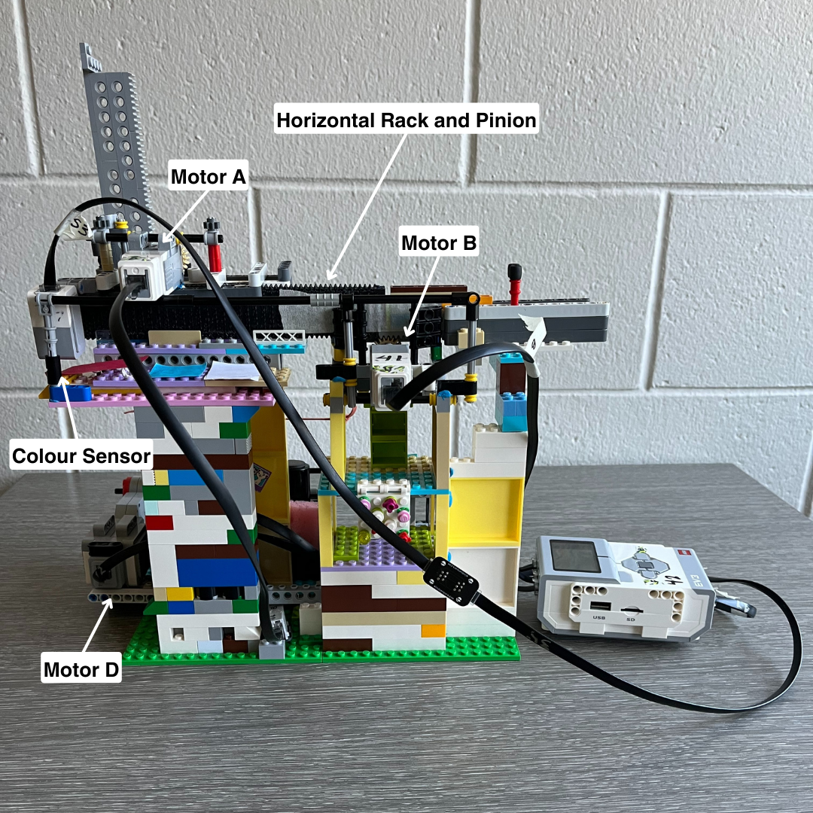

# NailTech LEGO EV3 Robot 
NailTech is a Lego Robot prototype designed to improve users' nail painting experience. It utilizes a 2D gantry system of racks and pinions to select a polish based on the user's selected colour, paint the nail, and repeat until the hand is complete. The robot was programmed using RobotC for LEGO Mindstorms. 

### Hardware Layout 
NailTech uses 3 motors and 2 sensors as described below: 
- MotorA: moves vertical rack and pinion
- MotorB: moves horizontal rack and pinion
- MotorD: controls "gripper" mechanism to return brushes
- Colour sensor: detects nail polish colour to select
- Touch sensor: acts as a stopping mechanism

The locations of the motors, sensors, and other components are shown in Figures 1 and 2 below. Please note that while this design prototype may not be visually refined, it functions effectively. Due to constraints on cost and time, spare LEGO bricks were used to minimize costs and manufacturing time.

_Figure 1: Front view of NailTech Robot_

_Figure 2: Back view of NailTech Robot_

### Collaborators
- Jier Qiu
- Emilia Keddie
- Siddhi Patel
- Caitlyn Staresinic

